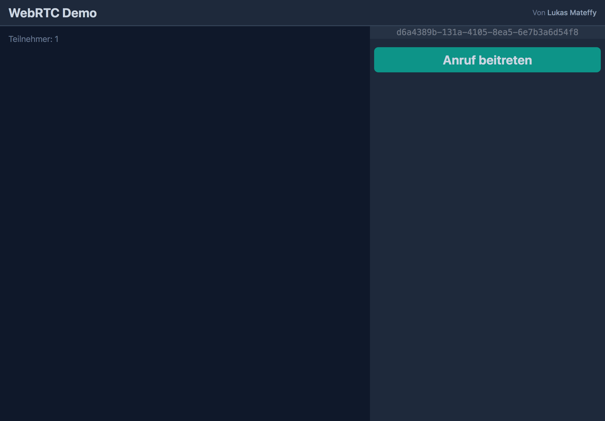
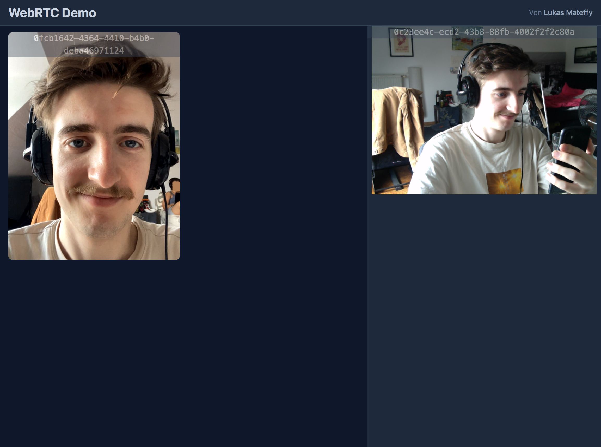

# WebRTC Demo

> Eine Demo, die eine simple Videochat-Implementierung mit WebRTC zeigt.

Wer der Seite beitritt, hat die Option, dem Videochat beizutreten.

Die Liste mit IDs der aktiven Teilnehmer wird über [Socket.io](https://peerjs.com) synchronisiert.

Der Aufbau der P2P-Verbindungen wird von [PeerJS](https://peerjs.com/) übernommen, einer JS-Bibliothek, die die WebRTC APIs ein wenig abstrahiert. Dazu bietet sie eine off-the-shelf Signalling-Implementierung ([PeerServer](https://github.com/peers/peerjs-server)) an, welche die Übermittlung des Session Description Protokolls übernimmt.

-   `src/` – _Der Signalling-Server_
-   `src/client/` – _Der Web-Client_

## Demo starten

```bash
# Repo klonen
git clone git@github.com:capevace/webrtc-demo
cd webrtc-demo

# Dependencies installieren
npm install

# Server starten
npm start

# Ist auf https://localhost:3000 erreichbar.
```

### HTTPS

Damit die WebRTC APIs verfügbar sind, muss die Seite über HTTPS laufen. Selbst-generierte Zertifikate sind in `src/certs/` vorhanden.Möglicherweise müssen diese auf manchen PCs mit lokal generierten ersetzt werden.

## Screenshots





## Open-Source Lizensen

-   [express](https://github.com/expressjs/express) (MIT)
-   [Socket.io](https://socket.io) (MIT)
-   [TailwindCSS](https://tailwindcss.com) (MIT)
-   [PeerJS](https://peerjs.com) (MIT)
